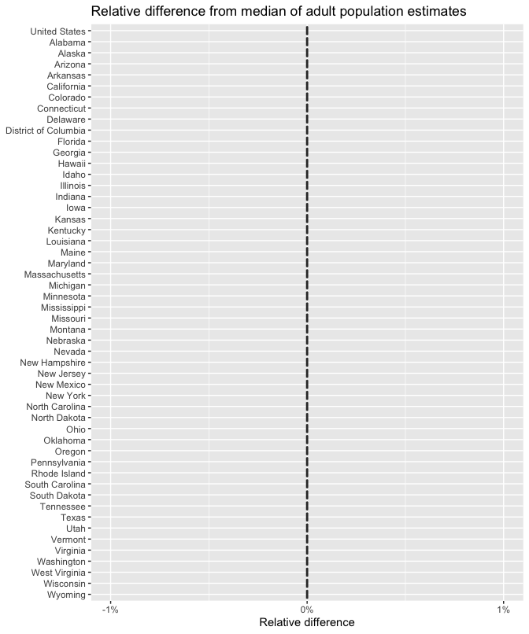
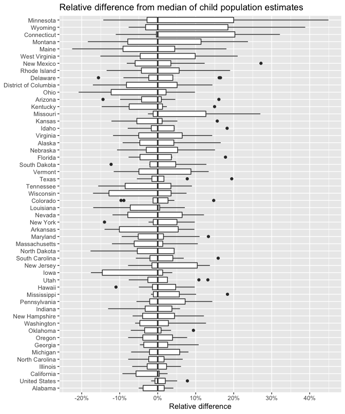

Test household weight approximation for Household Pulse Survey
================
Bill Behrman
2020-07-17

  - [The relative differences for adult population
    estimates](#the-relative-differences-for-adult-population-estimates)
  - [The relative differences for child population
    estimates](#the-relative-differences-for-child-population-estimates)

``` r
# Libraries
library(tidyverse)
library(rvest)

# Parameters
  # Household Pulse Survey (HPS) year
YEAR_HPS <- 2020
  # Base URL for HPS PUF data
url_hps <-
  str_glue("https://www2.census.gov/programs-surveys/demo/datasets/hhp/{YEAR_HPS}")
  # CSS for HPS PUF data directories
css_hps <- "body > table"
  # Temporary directory
dir_tmp <- str_glue("{tempdir()}/hps")

#===============================================================================

# Create temporary directory
fs::dir_create(dir_tmp)

# State FIPS
fips_states <- 
  tidycensus::fips_codes %>% 
  select(area = state_name, fips = state_code) %>% 
  distinct() %>% 
  arrange(fips)

# Weeks with HPS PUF data
weeks_hps <-
  str_glue(url_hps) %>%
  read_html(css = css_hps) %>%
  html_table() %>%
  pluck(2) %>%
  unlist() %>%
  map_chr(str_extract, pattern = "wk\\d+") %>%
  discard(is.na)

# Get HPS data for week and return estimates for child and adult populations
get_hps <- function(week) {

  # URL for data file
  file_hps <-
    str_glue(url_hps, "/{week}") %>%
    read_html(css = css_hps) %>%
    html_table() %>%
    pluck(2) %>%
    unlist() %>%
    str_extract(pattern = "^HPS_.*_PUF_CSV") %>%
    discard(is.na)
  url <- str_glue(url_hps, "/{week}/{file_hps}.zip")
  
  # Download and unzip data file
  dest <- str_glue("{dir_tmp}/{file_hps}.zip")
  result <- download.file(url = url, destfile = dest, quiet = TRUE)
  assertthat::assert_that(
    result == 0L,
    msg = message("Download failed")
  )
  unzip(zipfile = dest, exdir = str_glue("{dir_tmp}/{file_hps}"))
  
  # Read in data
  data <-
    fs::dir_ls(
      path = str_glue("{dir_tmp}/{file_hps}"),
      regexp = str_glue("pulse{YEAR_HPS}_puf_.*csv")
    ) %>%
    read_csv(
      col_types =
        cols_only(
          WEEK = col_double(),
          EST_ST = col_character(),
          PWEIGHT = col_double(),
          THHLD_NUMKID = col_double(),
          THHLD_NUMADLT = col_double()
        )
    ) %>%
    rename_with(str_to_lower) %>% 
    rename(fips = est_st)
  
  # Validate data
  stopifnot(
    n_distinct(data$week) == 1,
    all(!is.na(data$pweight)) && 0 < min(data$pweight),
    all(!is.na(data$thhld_numkid)) && 
      0 <= min(data$thhld_numkid) &&
      max(data$thhld_numkid) <= 5,
    all(!is.na(data$thhld_numadlt)) && 
      1 <= min(data$thhld_numadlt) &&
      max(data$thhld_numadlt) <= 10
  )
  
  # Estimate child and adult populations for U.S.
  us <- 
    data %>% 
    summarize(
      area = "United States",
      fips = "00",
      week = first(week),
      population_0_17 = sum((pweight / thhld_numadlt) * thhld_numkid),
      population_18p = sum(pweight) %>% round()
    )
  
  # Estimate child and adult populations for states
  states <- 
    data %>% 
    group_by(fips, week) %>% 
    summarize(
      population_0_17 = sum((pweight / thhld_numadlt) * thhld_numkid),
      population_18p = sum(pweight) %>% round()
    ) %>% 
    ungroup() %>% 
    left_join(fips_states, by = "fips") %>% 
    relocate(area)
  
  # Return estimates of child and adult populations for U.S. and states
  us %>% 
    bind_rows(states) %>% 
    arrange(fips)
}

# Calculate estimates for child and adult populations from HPS PUF data
hps <- 
  weeks_hps %>% 
  map_dfr(get_hps) %>% 
  arrange(fips, week)

# Remove temporary directory
fs::dir_delete(dir_tmp)
```

For the U.S. and each state, we will look at the relative difference of
the population estimates each week with the median of the estimates for
all weeks.

``` r
v <- 
  hps %>% 
  group_by(fips) %>% 
  mutate(
    rel_diff_0_17 = 
      (population_0_17 - median(population_0_17)) / median(population_0_17),
    rel_diff_range_0_17 =
      (max(population_0_17) - min(population_0_17)) / median(population_0_17),
    rel_diff_18p =
      (population_18p - median(population_18p)) / median(population_18p)
  )
```

## The relative differences for adult population estimates

``` r
v %>% 
  ggplot(aes(fct_reorder(area, fips) %>% fct_rev(), rel_diff_18p)) +
  geom_boxplot() + 
  scale_y_continuous(
    breaks = scales::breaks_width(0.01),
    labels = scales::label_percent(accuracy = 1)
  ) +
  coord_flip(ylim = c(-0.01, 0.01)) +
  labs(
    title = "Relative difference from median of adult population estimates",
    x = NULL,
    y = "Relative difference"
  )
```



The adult population estimates for the U.S. and each state are the same
for all weeks, as expected.

## The relative differences for child population estimates

``` r
v %>% 
  ggplot(aes(fct_reorder(area, rel_diff_range_0_17), rel_diff_0_17)) +
  geom_boxplot() + 
  scale_y_continuous(
    breaks = scales::breaks_width(0.1),
    labels = scales::label_percent(accuracy = 1)
  ) +
  coord_flip() +
  labs(
    title = "Relative difference from median of child population estimates",
    x = NULL,
    y = "Relative difference"
  )
```



The child population estimates for the U.S. and each state have a very
wide variation between weeks, ranging from -23% below the median to 45%
above the median.
